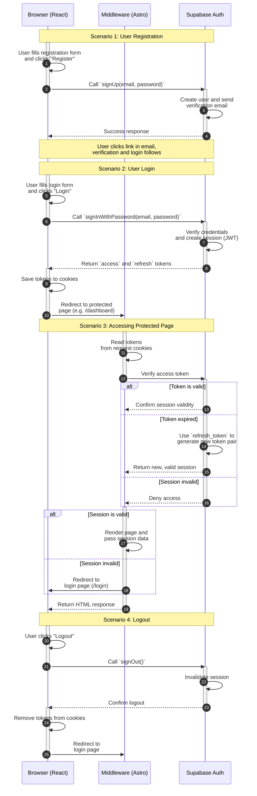

<authentication_analysis>

### 1. Authentication Flows

Based on the `prd.md` and `auth-spec.md` documents, the key authentication flows are:

- **User Registration:** A new user signs up with an email and password, provides consent, and verifies their email address.
- **User Login:** An existing user logs in with their credentials.
- **User Logout:** A logged-in user signs out.
- **Password Reset:** A user who has forgotten their password can reset it via email.
- **Session Management:** The system manages the user's session, including token validation and refresh, for both client-side and server-side requests.

### 2. Main Actors and Interactions

- **Browser (React Components):** The user interacts with React forms for login, registration, etc. It communicates with the Supabase Auth service directly for client-side authentication operations.
- **Astro (Middleware & Server-side Pages):** The Astro backend, specifically the middleware, intercepts every request. It uses cookies to manage the user's session, validates tokens, and protects routes. It also renders pages server-side, providing session information to them.
- **Supabase Auth:** The external BaaS provider that handles the core authentication logic, including user management, issuing JWTs, and sending emails (verification, password reset).

### 3. Token Verification and Refresh

- Supabase Auth issues a pair of tokens: an `access_token` (short-lived) and a `refresh_token` (long-lived).
- The tokens are stored securely in the browser's cookies.
- The Astro middleware inspects the `access_token` on every server-side request.
- If the `access_token` is expired, the Supabase SDK (via `@supabase/ssr` in the middleware) automatically uses the `refresh_token` to get a new pair of tokens from Supabase Auth. This process is seamless to the user.
- The client-side Supabase SDK also handles token refresh automatically for client-side operations.

### 4. Description of Authentication Steps

1.  **Registration:** The user submits the registration form. The browser-side React component calls `supabase.auth.signUp()`. Supabase Auth creates the user and sends a verification email. After the user clicks the link, they are authenticated and redirected.
2.  **Login:** The user submits the login form. The browser calls `supabase.auth.signInWithPassword()`. Supabase Auth verifies the credentials and returns tokens, which are set as cookies. The user is redirected to the dashboard.
3.  **Authenticated Request to Astro Page:**
    - The browser sends a request to an Astro page (e.g., `/dashboard`).
    - The Astro middleware intercepts the request, reads the auth cookies, and validates the session with Supabase.
    - If the session is valid, the middleware passes the session data to the page via `context.locals` and allows the request to proceed.
    - If the session is invalid (or missing), the middleware redirects the user to the login page.
4.  **Logout:** The user clicks the logout button. The browser calls `supabase.auth.signOut()`. The SDK clears the session cookies, and the user is redirected to the login page.
    </authentication_analysis>

