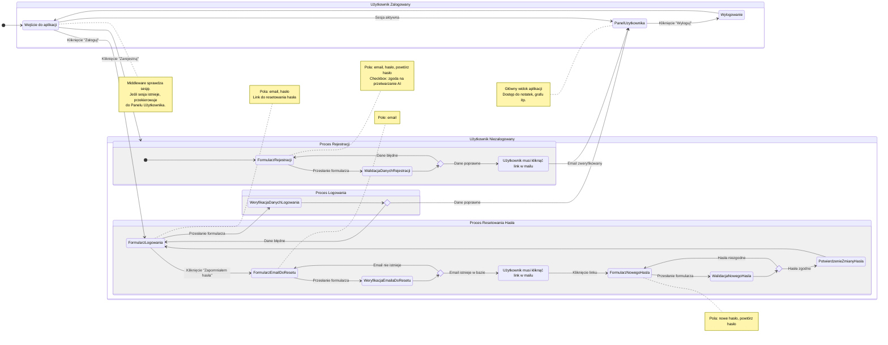

<user_journey_analysis>
### 1. Wypis ścieżek użytkownika
Na podstawie dostarczonych dokumentów (`prd.md` i `auth-spec.md`) zidentyfikowano następujące ścieżki użytkownika:
- **Korzystanie z aplikacji jako gość:** Użytkownik niezalogowany ma dostęp do stron publicznych, ale przy próbie dostępu do zasobów chronionych jest przekierowywany na stronę logowania.
- **Rejestracja nowego konta:** Użytkownik podaje e-mail, hasło oraz wyraża zgodę na przetwarzanie danych, a następnie musi potwierdzić swój adres e-mail, klikając w link weryfikacyjny.
- **Logowanie do systemu:** Zarejestrowany użytkownik podaje swoje dane uwierzytelniające, aby uzyskać dostęp do swojego konta.
- **Odzyskiwanie hasła:** Użytkownik, który zapomniał hasła, może zainicjować procedurę jego resetowania poprzez podanie swojego adresu e-mail.
- **Wylogowanie:** Zalogowany użytkownik może w każdej chwili zakończyć swoją sesję.
- **Korzystanie z aplikacji jako zalogowany użytkownik:** Użytkownik ma dostęp do pełnej funkcjonalności aplikacji, w tym do panelu z notatkami i grafu myśli.

### 2. Główne podróże i stany
- **Podróż Gościa:** Obejmuje wejście na stronę główną, nawigację do formularzy logowania/rejestracji oraz obsługę prób dostępu do chronionych sekcji.
- **Podróż Rejestracyjna:** Rozpoczyna się od wypełnienia formularza, przechodzi przez walidację danych, wysłanie e-maila weryfikacyjnego i kończy się aktywacją konta po kliknięciu w link.
- **Podróż Logowania:** Składa się z wypełnienia formularza logowania i weryfikacji poświadczeń.
- **Podróż Resetowania Hasła:** Inicjowana przez użytkownika, obejmuje wysłanie linku do resetu na e-mail i proces ustawiania nowego hasła.
- **Podróż Zalogowanego Użytkownika:** Obejmuje dostęp do głównego panelu aplikacji oraz możliwość wylogowania się.

### 3. Punkty decyzyjne i alternatywne ścieżki
- **Weryfikacja sesji:** System sprawdza, czy użytkownik jest zalogowany. Jeśli tak, uzyskuje dostęp do zasobów chronionych; jeśli nie, jest traktowany jako gość.
- **Walidacja formularzy:** Dane wprowadzane w formularzach (rejestracji, logowania, zmiany hasła) są walidowane. Błędne dane skutkują wyświetleniem komunikatów o błędach, a poprawne pozwalają kontynuować proces.
- **Weryfikacja e-mail:** Kliknięcie w link weryfikacyjny jest kluczowym punktem decyzyjnym w procesie rejestracji, który aktywuje konto użytkownika.
- **Status poświadczeń logowania:** System sprawdza, czy dane logowania są poprawne. Błędne dane uniemożliwiają logowanie.

### 4. Cel każdego stanu
- **StronaGłówna (dla Gościa):** Służy jako punkt wejścia i wizytówka aplikacji, kierując niezalogowanych użytkowników do odpowiednich akcji (logowanie/rejestracja).
- **FormularzRejestracji:** Umożliwia zebranie od użytkownika informacji niezbędnych do utworzenia konta.
- **OczekiwanieNaWeryfikacjeEmaila:** Stan pośredni, który informuje użytkownika o konieczności potwierdzenia adresu e-mail, co jest kluczowe dla bezpieczeństwa i weryfikacji.
- **FormularzLogowania:** Zapewnia mechanizm uwierzytelniania dla powracających użytkowników.
- **PanelUzytkownika:** Główny obszar roboczy aplikacji, w którym użytkownik realizuje kluczowe zadania (np. zarządzanie notatkami).
- **ProcesResetuHasla:** Zapewnia użytkownikom bezpieczną ścieżkę do odzyskania dostępu do konta w przypadku zapomnienia hasła.
</user_journey_analysis>

