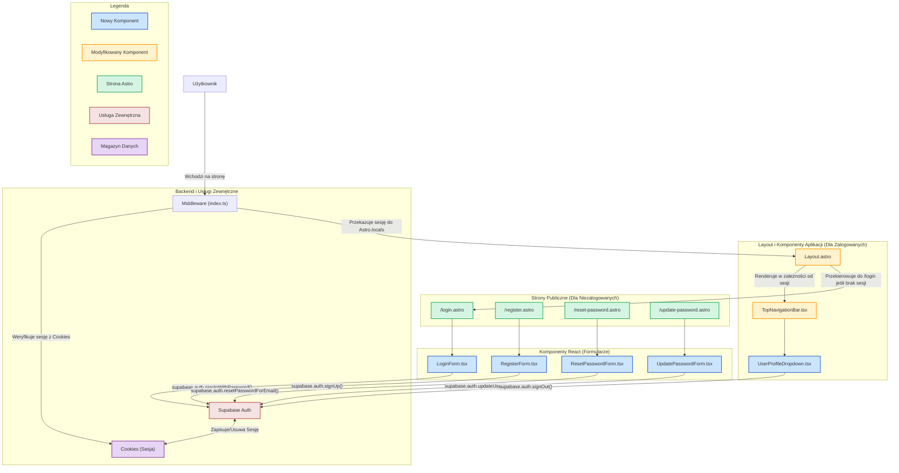

<architecture_analysis>

### 1. Lista Komponentów i Stron

Na podstawie dokumentacji `prd.md` oraz `auth-spec.md`, zidentyfikowano następujące strony Astro i komponenty React, które będą tworzyć moduł uwierzytelniania i interfejs użytkownika.

**Strony Astro (w `src/pages/`)**

- `login.astro`: Strona logowania, dostępna dla niezalogowanych użytkowników.
- `register.astro`: Strona rejestracji, dostępna dla niezalogowanych użytkowników.
- `reset-password.astro`: Strona do inicjowania procesu resetowania hasła.
- `update-password.astro`: Strona do ustawiania nowego hasła po przejściu z linku resetującego.

**Nowe Komponenty React (w `src/components/auth/`)**

- `LoginForm.tsx`: Formularz z polami na e-mail i hasło, obsługujący logikę logowania.
- `RegisterForm.tsx`: Formularz z polami na e-mail, hasło, potwierdzenie hasła i zgodę na przetwarzanie danych AI.
- `ResetPasswordForm.tsx`: Formularz z polem na e-mail do wysłania linku resetującego.
- `UpdatePasswordForm.tsx`: Formularz do ustawienia nowego hasła.

**Modyfikowane/Nowe Komponenty Layoutu (w `src/components/layout/`)**

- `Layout.astro` (w `src/layouts/`): Główny layout aplikacji, który będzie warunkowo renderował elementy UI w zależności od stanu zalogowania użytkownika.
- `TopNavigationBar.tsx`: Główny pasek nawigacyjny, który będzie wyświetlany zalogowanym użytkownikom.
- `UserProfileDropdown.tsx`: Nowy komponent wewnątrz `TopNavigationBar`, wyświetlający menu użytkownika z opcją wylogowania.

### 2. Główne Strony i Ich Komponenty

- **Strona Logowania (`/login`)**:
  - **Strona Astro:** `login.astro`
  - **Główny Komponent React:** `LoginForm.tsx`
  - **Opis:** Renderuje formularz logowania. Po pomyślnym zalogowaniu, użytkownik jest przekierowywany do panelu głównego.
- **Strona Rejestracji (`/register`)**:
  - **Strona Astro:** `register.astro`
  - **Główny Komponent React:** `RegisterForm.tsx`
  - **Opis:** Renderuje formularz rejestracji. Po pomyślnej rejestracji i weryfikacji e-mail, użytkownik uzyskuje dostęp do aplikacji.
- **Strona Resetowania Hasła (`/reset-password`)**:
  - **Strona Astro:** `reset-password.astro`
  - **Główny Komponent React:** `ResetPasswordForm.tsx`
  - **Opis:** Umożliwia użytkownikowi podanie adresu e-mail, na który zostanie wysłany link do zresetowania hasła.
- **Layout Aplikacji (dla zalogowanych)**:
  - **Layout Astro:** `Layout.astro`
  - **Komponenty React:** `TopNavigationBar.tsx`, `UserProfileDropdown.tsx`
  - **Opis:** `Layout.astro` sprawdza sesję użytkownika (dostarczoną przez middleware) i renderuje pełny interfejs aplikacji, w tym nawigację z menu użytkownika.

### 3. Przepływ Danych

1.  **Niezalogowany Użytkownik:**
    - Użytkownik wchodzi na stronę `/login` lub `/register`.
    - `Layout.astro` renderuje uproszczony nagłówek bez nawigacji użytkownika.
    - Strony `login.astro` lub `register.astro` renderują odpowiednie komponenty formularzy (`LoginForm.tsx`, `RegisterForm.tsx`).
    - Formularze komunikują się bezpośrednio z Supabase Auth po stronie klienta, aby przeprowadzić proces logowania lub rejestracji.
    - Po pomyślnej operacji, Supabase tworzy sesję w cookies, a aplikacja przekierowuje użytkownika do panelu głównego.
2.  **Zalogowany Użytkownik:**
    - Przy każdym żądaniu, `middleware/index.ts` weryfikuje sesję z cookies i umieszcza ją w `Astro.locals.session`.
    - `Layout.astro` odczytuje sesję z `Astro.locals` i renderuje pełną nawigację (`TopNavigationBar.tsx` z `UserProfileDropdown.tsx`).
    - Komponent `UserProfileDropdown.tsx` zawiera przycisk "Wyloguj", który wywołuje `supabase.auth.signOut()`, usuwając sesję z cookies i przekierowując na stronę logowania.
3.  **Ochrona Stron:**
    - Middleware (`src/middleware/index.ts`) chroni strony wymagające uwierzytelnienia (np. `/dashboard`). Jeśli niezalogowany użytkownik spróbuje na nie wejść, zostanie przekierowany na `/login`.
    - Middleware przekierowuje również zalogowanych użytkowników próbujących wejść na `/login` lub `/register` do strony głównej.

### 4. Opis Funkcjonalności Komponentów

- `LoginForm.tsx`: Odpowiedzialny za walidację pól (e-mail, hasło) i wywołanie `supabase.auth.signInWithPassword()`. Wyświetla błędy i zarządza stanem formularza.
- `RegisterForm.tsx`: Waliduje pola (e-mail, hasło, zgoda AI), wywołuje `supabase.auth.signUp()` i informuje użytkownika o konieczności weryfikacji e-maila.
- `ResetPasswordForm.tsx`: Waliduje pole e-mail i wywołuje `supabase.auth.resetPasswordForEmail()`.
- `UpdatePasswordForm.tsx`: Waliduje nowe hasło i wywołuje `supabase.auth.updateUser()`.
- `Layout.astro`: Centralny punkt decyzyjny UI, który na podstawie sesji decyduje, czy renderować widok dla zalogowanego, czy niezalogowanego użytkownika.
- `UserProfileDropdown.tsx`: Komponent UI zapewniający funkcjonalność wylogowania poprzez wywołanie `supabase.auth.signOut()`.

</architecture_analysis>

<mermaid_diagram>

</mermaid_diagram>
